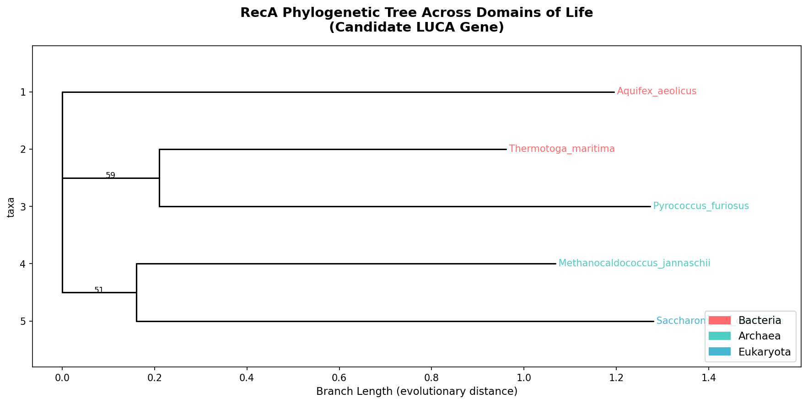

# LUCA Phylogenetic Analysis

Computational reconstruction of the Last Universal Common Ancestor (LUCA) 
using conserved gene families across all three domains of life.

## Tools Used
- Biopython, MAFFT, trimAl, IQ-TREE, Python

## Results

